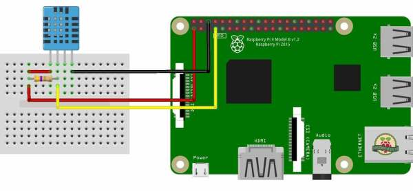

# smarthomeworkshop
Tutorial voor de smart home workshop

blablabla

# Stap 1: Aansluiten DHT sensor

- diagram pi gpio pins
- aansluiten ground, power, data, resistor

# Stap 2: Verbinden Home Assistant

- opstarten pi
- navigeren naar ip adres browser

# Stap 3: Koppelen DHT sensor Home Assistant

- inloggen met SSH
- kopieren YAML
- reboot?
- terug naar dashboard

# Stap 4: Automation maken

- stappen doorlopen dashboard
- json plakken

