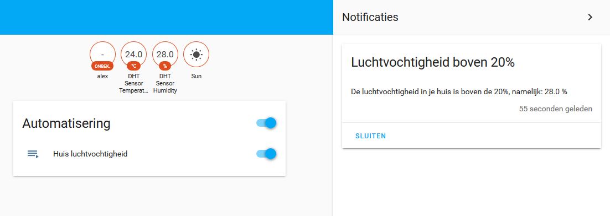

# Smart Home Workshop Capita Selecta

Dit is de tutorial voor de smart home workshop die tijdens het seminar gegeven wordt. In deze repository vindt je een stap-voor-stap uitleg voor het aansluiten van de DHT11 sensor aan Home Assistant op een Raspberry Pi. Tevens staan hier ook alle complete `.yaml` (configuratie) files in. Geschatte tijd: 10-15 minuten.

Je hebt als het goed is een setje met spullen gekregen. Check of je alles hebt:

- 1x Raspberry Pi 3B
- 1x DHT11 sensor
- 1x weerstand
- 1x breadboard
- 1x USB naar micro-USB kabel
- 4x kabels

## Stap 1: Aansluiten DHT sensor

Voordat je de Pi aan zet gaan we eerst de DHT11 sensor aansluiten. Doe dit als volgt:

- Sensor Pin 1 -> Raspberry Pi pin 1 (3.3V)
- Sensor Pin 2 -> Raspberry Pi pin 7 (GPIO 4)
- Sensor Pin 3  gebruiken we niet.
- Sensor Pin 4 -> Raspberry Pi pin 6 (Ground)

Let op dat je de oriëntatie van de DHT11 goed hebt en de weerstand op de juiste manier hebt aangesloten. Gebruik onderstaande diagrammen als hulpmiddel.


## Stap 2: Verbinden Home Assistant

Nu we de sensor hebben aangesloten gaan we verbinden met de Home Assistant software. Als het goed is zit er een post-it op je Raspberry Pi met een IP-adres, deze heb je zometeen nodig. Volg nu deze stappen:

- Sluit de stroom aan op je Raspberry Pi met de bijgeleverde USB-kabel
- Verbind op je laptop met het Wi-Fi netwerk "SmartHomeWorkshop", het wachtwoord is **Appelflap1**
- Wacht 1-2 minuten zodat de Pi kan opstarten
- Op je laptop, navigeer met je browser naar het IP adres van je Raspberry Pi op poort 8123. Dus bijvoorbeeld: `http://10.1.0.11:8123`
- Log in met **username: pi** en **wachtwoord: Appelflap1**

Als het goed is kom je nu op het dashboard van de Home Assistant software terecht. Ga verder naar de volgende stap.

## Stap 3: Koppelen DHT sensor Home Assistant

In deze stap gaan we de DHT11 sensor koppelen aan Home Assistant. Dit gaan we doen middels het aanpassen van een configuratiefile via SSH. Aan het einde moeten de waarden van de sensor in het dashboard beschikbaar zijn. Volg deze stappen:

- Zet een SSH verbinding op naar het IP adres van je Raspberry Pi, met **username: pi** en **wachtwoord: raspberry**. Navigeer naar de Home Assistant folder:

 ```bash
  cd /home/homeassistant/.homeassistant
  sudo nano configuration.yaml
  ```

- Zet vervolgens de volgende configuratie in de file. Let op spatiegebruik:

 ```yaml
  sensor:
    - platform: dht
      sensor: DHT11
      pin: 4
      monitored_conditions:
        - temperature
        - humidity
  ```

- Herstart nu de Raspberry Pi:

 ```shell
  sudo reboot
  ```

- Navigeer na het opstarten vervolgens weer naar het Home Assistant dashboard in je browser. De waardes zullen nu zichtbaar moeten zijn op het dashboard:


## Stap 4: Automation maken

Nu de DHT11 sensor gekoppeld is aan Home Assistant gaan we deze gebruiken voor het opzetten van een "automation". We maken voor deze workshop een simpele automation aan: als de luchtvochtigheid boven een bepaald % komt genereren we een notificatie op het dashboard. Met Home Assistant kun je echter nog veel meer en complexere automations maken.

- Navigeer in het dashboard naar Instellingen > Automatisering > Rechtsonderin op het plusje

- Geef je automation een naam

- Stel de trigger als volgt in:

  - Trigger-type: Numerieke staat
  - Entiteit: DHT sensor Humidity
  - Boven: 40 (Hangt af van de luchtvochtigheid in het lokaal)
  - De rest van de trigger kun je leeg laten

- Stel de actie als volgt in:

  - Type actie: service aanroepen

  - Service: persistent_notification.create

  - Service data: hier moet je wat JSON in plakken:

     ```json
      {
          "title": "Luchtvochtigheid boven 40%",
          "message": "De luchtvochtigheid in je huis is boven de 40%, namelijk: {{ states.sensor.dht_sensor_humidity.state_with_unit }}"
      }
      ```

- Klik vervolgens rechtsonderin op het Save icoontje

Als je nu weer teruggaat naar het dashboard zie je na 1-2 minuten als het goed is rechtsbovenin een notificatie binnenkomen. Zie je dit niet, zet dan de "boven" waarde in de automation wat lager, bijvoorbeeld op 20%.

